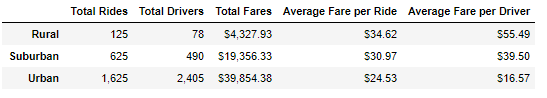
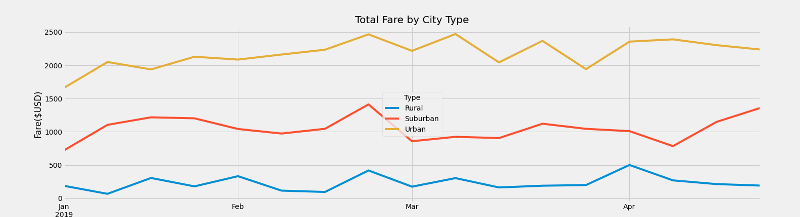

# PyBer Analysis (using Matplotlib)
---
## Overview of Project
PyBer, a Python based ride-sharing app company has requested an exploratory
analysis. Through visualizations, the aim is to tell a story about the data
and if there are any actionable steps to improve the ride-sharing service.
In addition, the analysis will look at affordability and if there is any 
room for improvement.

### Purpose
Putting our Python skills and knowledge of Pandas to the test, 
the object of the assignment should produce a summary dataframe
 of *ride-sharing data by city types*. As such, 3 city types 
have been identified: "Urban", "Suburban" and "Rural". 
Expanding our skills, we're also using Matplotlib
to create graphic visualizations, like a multiple-line graph, 
that reflects the *total weekly fares for each city type*.

---
## Results

> Using Jupyter Notebook, we were provided a starter code to generate a Summary
DataFrame and produce a multiple-line chart. Within the code, `pandas` was used
to read through 2 csv files and merge the two data sets together. Joining the datasets
by "city", we were able to generate the totals of rides, drivers, and fares by each city type using
the `groupby` function. Next we calculated the average fare per ride 
and average fare per driver for each city type.

*Summary DataFrame:* 

>In the next deliverable, we created a new DataFrame for the purpose of generating
a multiple-line chart by using `groupby` and `sum` to get the sum of fares by city
type and date. Next, in order for the `pivot` function to work, we needed to reset the current index
and change the index to "date". In addition, `pivot` allowed us to determine our columns to be the
different city types and the values within the dataframe to reflect the fares. Thereafter, we transformed
the data into a different dataframe using the `resample` function. This new dataframe reflects the
total fares per week by city type, which in essence is the data we used to plot on the chart.

*DataFrame after resampling:*  

Using matplotlib and the "fivethirtyeight" style, we graphed the total fare by city types.
Here we see the spread of 4 months regarding the total fares on a weekly basis.

### *Describe the differences in ride-sharing data among the different city types.*

Based on the summary dataframe, we can see that the revenue is higher in urban cities
in comparison to the other two city types. In addition, urban cities have the lowest
average fare per ride and per driver. Inversely, rural cities have the least amount 
of riders and drivers with the highest average fare per ride and per driver.
Looking at average fares between city types, the fares per ride have about a $10 range gap
(Urban $24.53 vs Rural $34.62) whereas the range for average fares per driver is about a $39
gap ($16.57 vs Rural $55.49). This shows with limited drivers available, there isn't much competition
and as a result a higher pay day for the driver. In addition, the data suggest with the higher
prices per ride in rural cities, riders may not be inclined to use the ride-sharing app.
Moving into the line chart, we see the trend of total fares. Here we see that fares, for all
city types, are gently fluctating up and down. Over time, the trend generally remains flat.
Interestingly, we see a spike in total fares for all city types on the last week of February
and then suddenly drop the first week of March. This may call for further look into the data.
Moreover, we can see high profitability in Urban markets and room for improvements in the Rural 
and Suburban markets.

---
## Summary

*Provide three business recommendations to the CEO for addressing
 any disparities among the city types.*

1. Looking at the Summary DataFrame, when there are less drivers to riders,
the fares are higher. I would considering increasing the amount of drivers
in both rural and suburban city types. Modeling the urban city blueprint, 
the data implies increasing the amount of drivers could lower the average fare per ride.
Resultantly, lower fare rides could increase the amount of riders and increase the
total amount of fares, creating profitability in these markets. 
2. In addition, I think it would be important to consider that increasing the amount of
drivers would mean the average fare per driver would decrease. Across all city types,
I would recommend creating incentives to attract more drivers. With lower fares,
PyBer should consider ways to offset these cuts should drivers be added to rural and
suburban areas. At the same time, PyBer should consider extending these offsets to
drivers in Urban areas since their current average fare is low. I recommend doing
additional analysis and taking a closer look at PyBer drivers and what PyBer can offer. 
3. In the same way that there needs to be a push for more drivers, there should also be
a push for more riders. Consider a marketing campaign to encourage more riders in rural 
and suburban area to use the app. Create an appeal. Maybe even consider a collaboration
with some local event coordinators. PyBer could host a local event and be the official
partner to offer discounted rates to the event. The possibilities are endless. In addition,
based on the data, there are less riders in the colder months. Hence, seasonality should be
considered in these campaigns. It might also be good to look at a full year's worth of data
to gauge if there are any specific months or weeks to target.

Overall, there is definitely room for improvements to increase profitability and experience.
